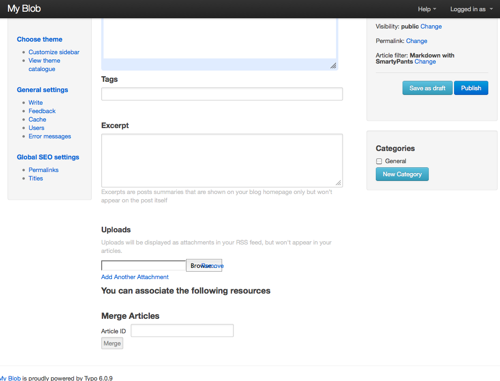

A: SPECIFY FEATURES
===================

We want to add a useful feature called article merging.  When there are multiple bloggers on one site, the authors may write more than one article on the same topic and say similar things.  The user will be able to visit the article view, and, if they are an admin, there should be a form on that article’s edit page that allows an administrator to enter in the ID of another article to merge the current article with.  When this happens, we want to preserve both articles’ content, but merge them together into one article. 

**Note**: Before merging articles you should verify that both specified articles exist, and that they are not the same article.

Scenarios
---------

To do this properly, we want to keep the following in mind:
 
1. A non-admin cannot merge articles.
2. When articles are merged, the merged article should contain the text of both previous articles.
3. When articles are merged, the merged article should have one author (either one of the authors of the original article).  
4. Comments on each of the two original articles need to all carry over and point to the new, merged article.
5. The title of the new article should be the title from either one of the merged articles.

Start by writing cucumber scenarios for the above behaviors. You will probably want to put them in separate feature files. You may add them to the existing feature files. Over the rest of part A and all of part B we will make these go green. 

Below is a mockup for the merge articles interface [hi-res]. The form for merging articles should be on the edit page for an article and it should let the user input the id of the article to be merged with. The merge interface should not be presented for new articles nor to non-administrators, but it is fine for the merge articles functionality to be present for drafts (we will not conduct any tests using draft articles). Make sure that the form field containing the ID of the article to merge has the name ‘merge_with’.

**Tip**: Nesting `<form>` tags is invalid in HTML. Most browsers will only accept the outermost form tag. Be careful of which views you edit: a view partial may be rendered while inside of another form tag, so creating another form inside of it would be invalid.

Next: [Driving Changes through Specs](driving_changes_through_specs.md)
